# Lab 1: HTTP File Server & Client
Name: Ceaetchii Andrei

## 1. Source Directory Structure
The project contains a public folder where shared information is stored, as well as the client and server implementations, each with its own Dockerfile, and a docker-compose.yml file for running the containers together.
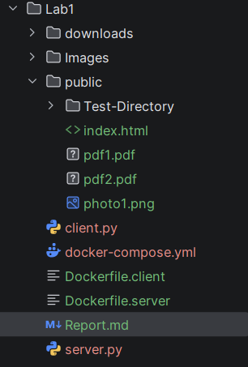
## 2. Docker Configuration Files
### docker-compose.yml
```yaml
services:
  http-server:
    build:
      context: .
      dockerfile: ./Dockerfile.server
    container_name: http-server
    ports:
      - "8080:8080"
    networks:
      - network-lab
    healthcheck:
      test: ["CMD", "curl", "-f", "http://localhost:8080/"]
      interval: 30s
      timeout: 10s
      retries: 3

  http-client:
    build:
      context: .
      dockerfile: ./Dockerfile.client
    container_name: http-client
    depends_on:
      http-server:
        condition: service_healthy
    networks:
      - network-lab
    command: ["python", "client.py", "http-server", "8080", "index.html"]

networks:
  network-lab:
    driver: bridge
    ipam:
      config:
        - subnet: 172.20.0.0/16
```

### Dockerfile
```dockerfile
FROM python:3.11-slim

WORKDIR /app
COPY server.py .
COPY public ./public

EXPOSE 8080

CMD ["python", "server.py"]
```

```dockerfile
FROM python:3.11-slim

WORKDIR /app
COPY client.py .

# Wait for server to start (compose handles healthcheck)
CMD ["python", "client.py", "http-server", "8080", "index.html"]

```

## 3. Starting the Container
Running the server using Docker Compose with making sure you are in the right directory `cd lab1` and `docker-compose up`:

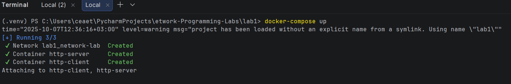
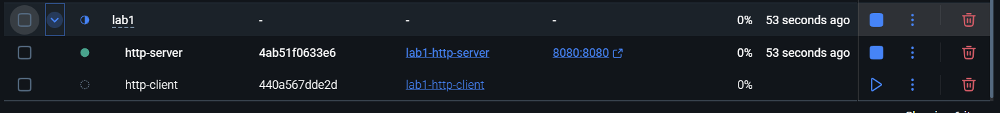

## 4. Server Running Inside Container
After starting the server, you can access localhost:8080 to view the main interface. The files are loaded from the lab1/public folder.
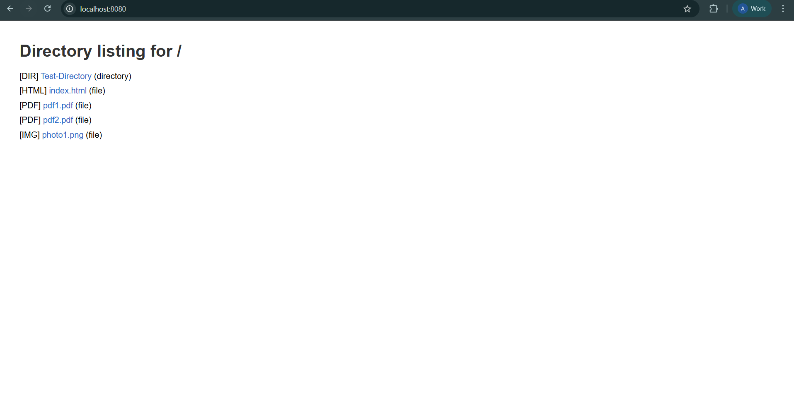

## 5. Browser Requests

### 5.1. Request for Non-Existent File (404)
Requesting a file that doesn't exist returns a 404 Not Found error.

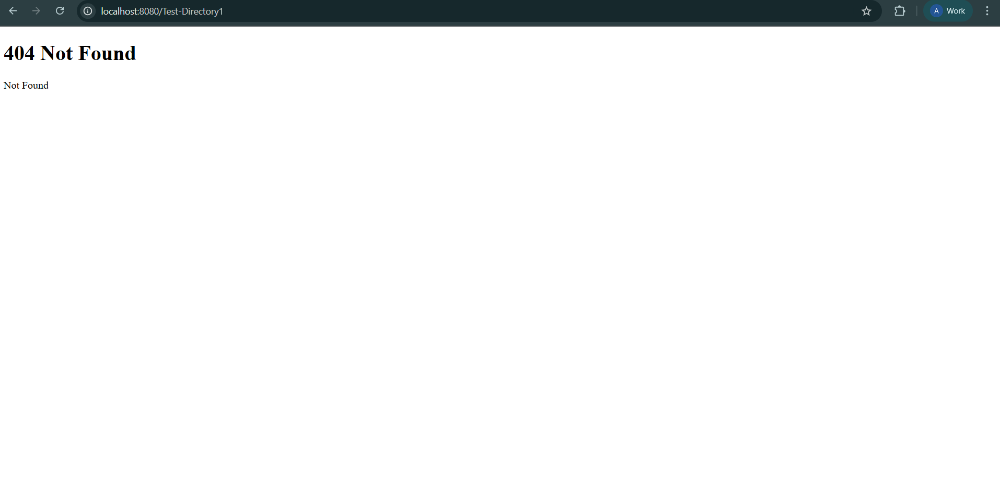

### 5.2. Request for HTML File with Embedded Image

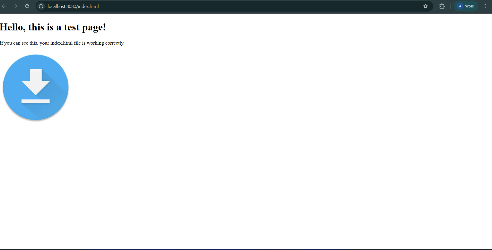

### 5.3. Request for PDF File

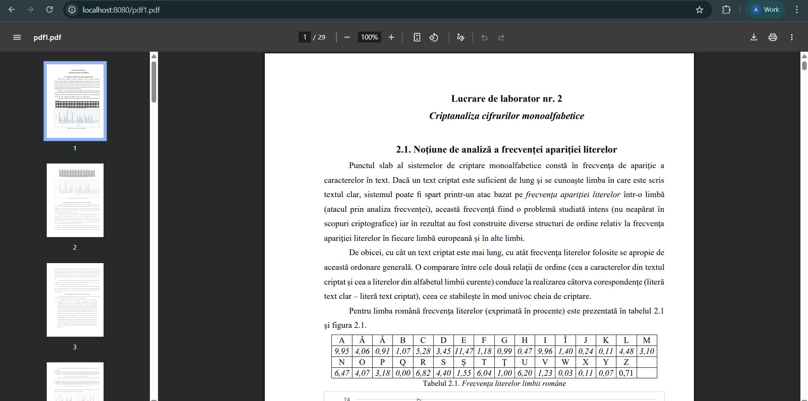

### 5.4. Request for PNG File
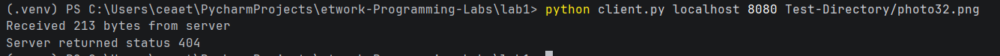

## 7. Client Implementation
### Running the Client
The client can request files from the server using the command:
```shell
python3 client.py <server_host> <server_port> <filename>
```

### Client Output - HTML File
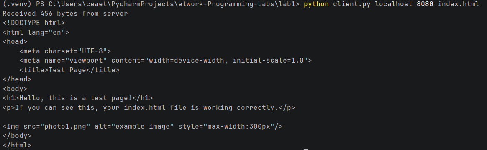

### Client Output - Image and PDF Files
Requesting binary files saves them to the `downloads/` directory:

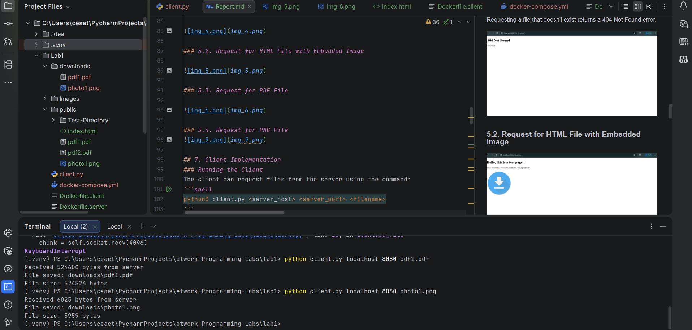

### Client Handling 404 Errors
When requesting a non-existent file, the client receives a 404 response:


### Connect to friend s server
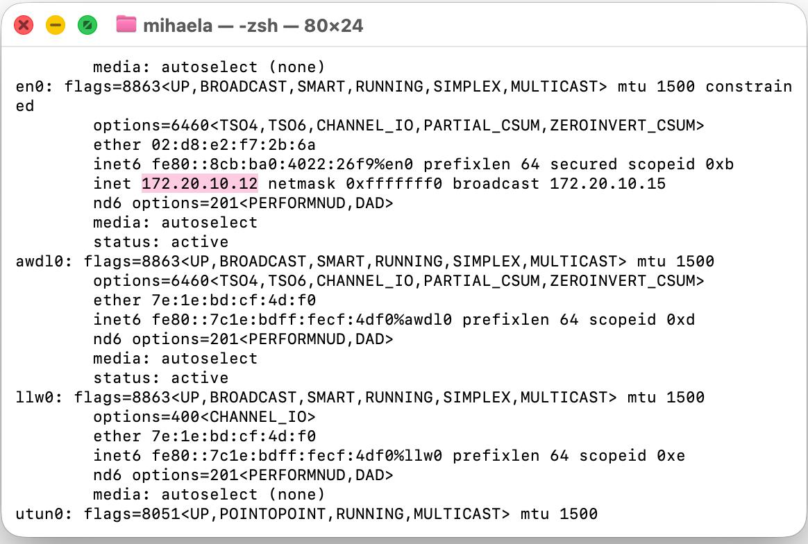
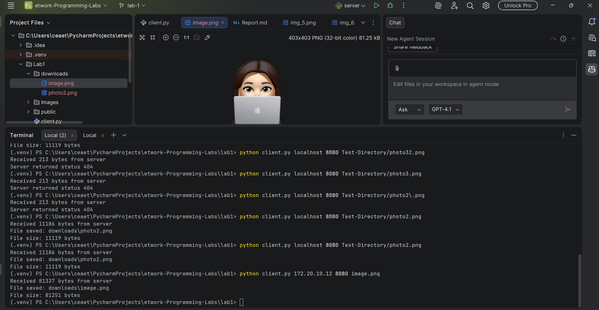
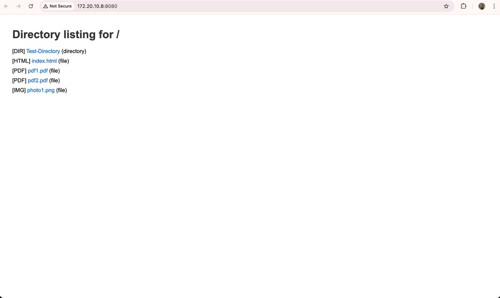
## Conclusion
In this lab, we built a simple yet functional HTTP file server and client using Python. The implementation supported file retrieval, navigation through nested directories, and downloading various file types including HTML, PNG, and PDF. Our testing confirmed that the server responds appropriately to valid requests, provides directory listings, and returns accurate 404 errors for missing resources. Overall, the project demonstrated fundamental concepts of HTTP communication and file handling in a networked environment.