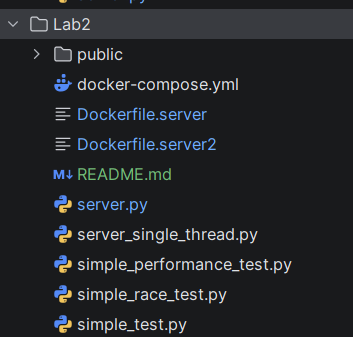
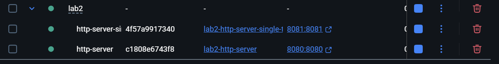
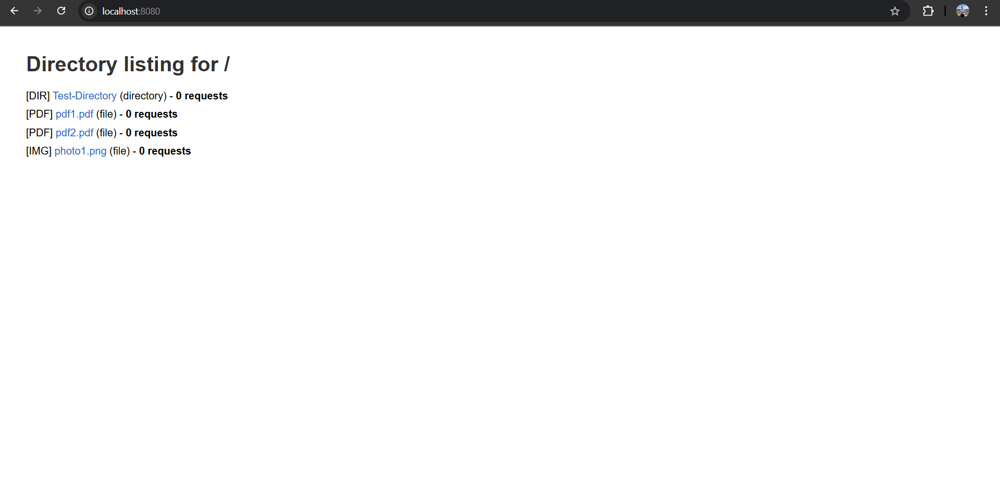
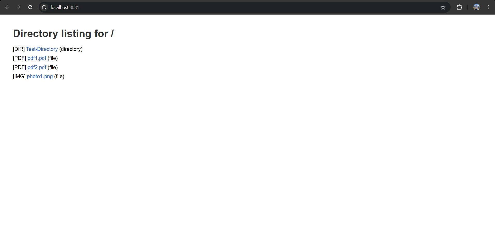
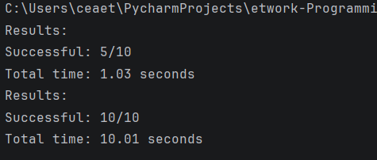
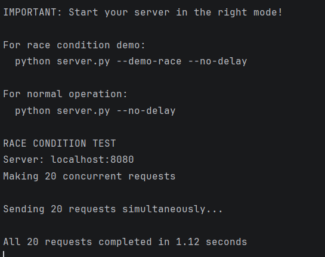
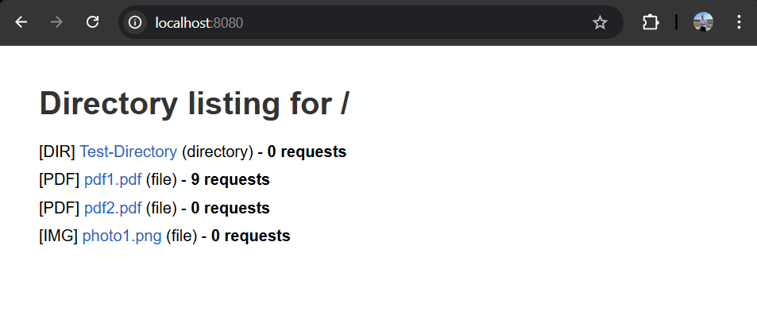
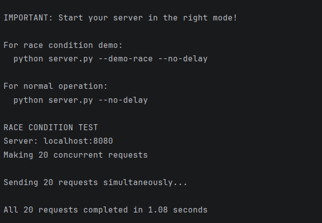
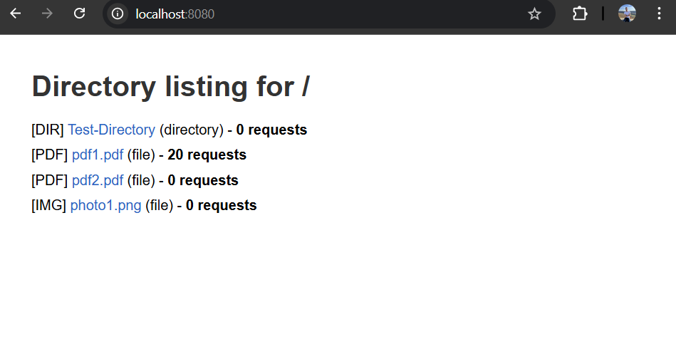
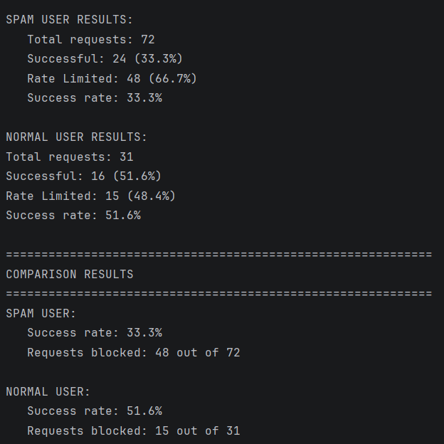

# **Lab 2: HTTP File Server & Client**

**Name:** Ceaetchii Andrei

---

## **1. Source Directory Structure**

The project contains a `public` folder where shared files are stored, as well as separate client and server implementations. Each implementation has its own Dockerfile, and the setup includes a `docker-compose.yml` file for running all containers together.



---

## **2. Docker Configuration Files**

### **docker-compose.yml**

```yaml
services:
  http-server:
    build:
      context: .
      dockerfile: ./Dockerfile.server
    container_name: http-server
    ports:
      - "8080:8080"
    networks:
      - network-lab
    healthcheck:
      test: [ "CMD", "curl", "-f", "http://localhost:8080/" ]
      interval: 30s
      timeout: 10s
      retries: 3

  http-server-single-threaded:
    build:
      context: .
      dockerfile: ./Dockerfile.server2
    container_name: http-server-single-threaded
    ports:
      - "8081:8081"
    networks:
      - network-lab
    healthcheck:
      test: [ "CMD", "curl", "-f", "http://localhost:8081/" ]
      interval: 30s
      timeout: 10s
      retries: 3

networks:
  network-lab:
    driver: bridge
```

### **Dockerfiles**

**Dockerfile.server**

```dockerfile
FROM python:3.11-slim

WORKDIR /app
COPY server.py .
COPY public ./public

EXPOSE 8080

#CMD ["python", "server.py", "--demo-race --no-delay"]
CMD ["python", "server.py", "--no-delay"]
```

**Dockerfile.server2**

```dockerfile
FROM python:3.11-slim

WORKDIR /app
COPY server_single_thread.py .
COPY public ./public

EXPOSE 8081

CMD ["python", "server_single_thread.py"]
```

---

## **3. Starting the Containers**

To start the servers using Docker Compose, make sure you are in the correct directory (`cd lab2`) and run:

```bash
docker-compose up
```



---

## **4. Server Running Inside Containers**

Once the servers are running, you can access them in your browser:

* **Multithreaded server:** [http://localhost:8080](http://localhost:8080)
* **Single-threaded server:** [http://localhost:8081](http://localhost:8081)

The files are loaded from the `lab1/public` folder.




---

## **5. Server Testing**

### **5.1. Simple Performance Test (10 Requests)**

The multithreaded server handles multiple requests concurrently, completing them significantly faster than the single-threaded server, which processes only one request at a time.



---

### **5.2. Race Condition Test**

By introducing artificial delays (e.g., `sleep(1s)`), we can observe that the single-threaded server struggles to respond to all requests in time. In contrast, the multithreaded implementation successfully handles all requests simultaneously.






---

### **5.3. Spam vs. Normal User Test**

The multithreaded server includes a rate-limiting mechanism that allows a maximum of **5 requests per second per user**. This prevents spam users from overloading the server while allowing normal users to continue making legitimate requests.



---

## **Conclusion**

In this lab, we developed a basic yet functional HTTP file server and client using Python. The system supports serving static files, browsing directories, and downloading various file types such as HTML, PNG, and PDF. Both single-threaded and multithreaded server versions were implemented and compared.

Through testing, we demonstrated that the multithreaded server can handle concurrent requests efficiently, reducing response times and improving reliability under load. The inclusion of rate limiting helped protect the server against spam or abusive clients.

Overall, this lab provided a practical understanding of how HTTP servers manage client requests, concurrency, and resource sharing. It served as a solid introduction to core networking concepts and containerized deployment using Docker.

---